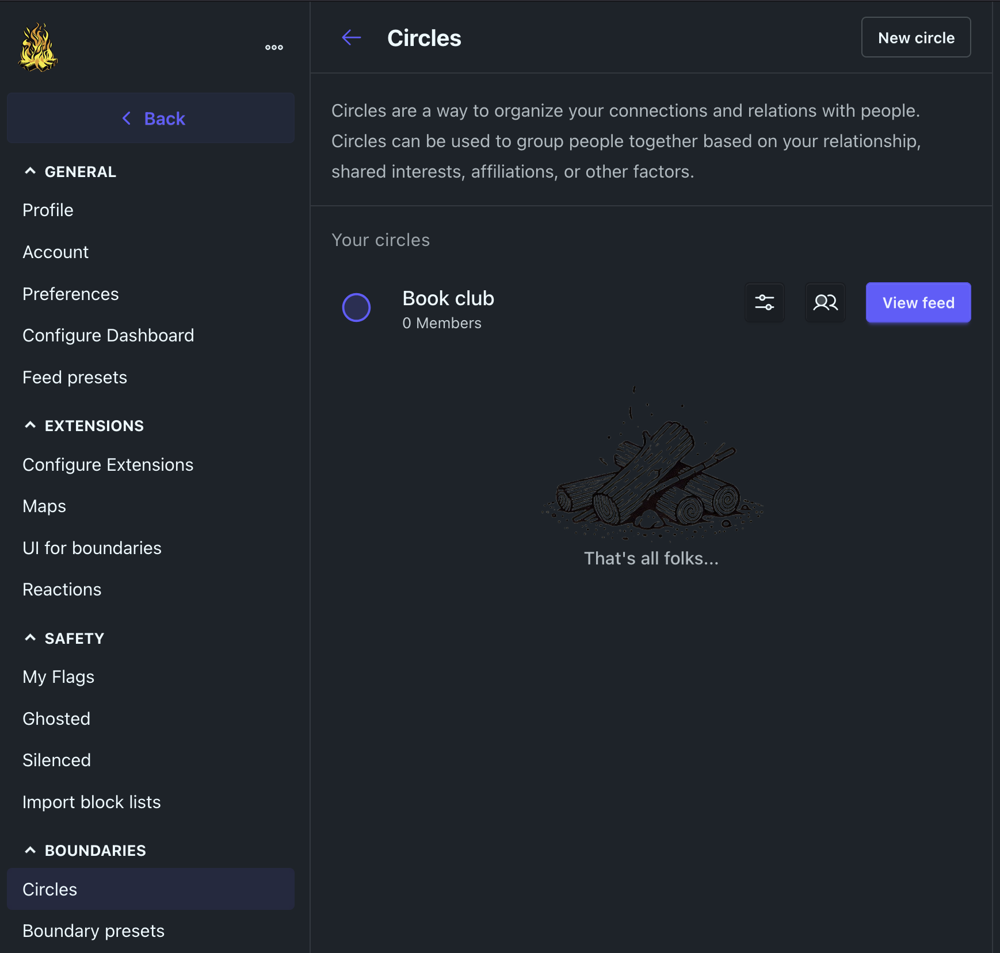
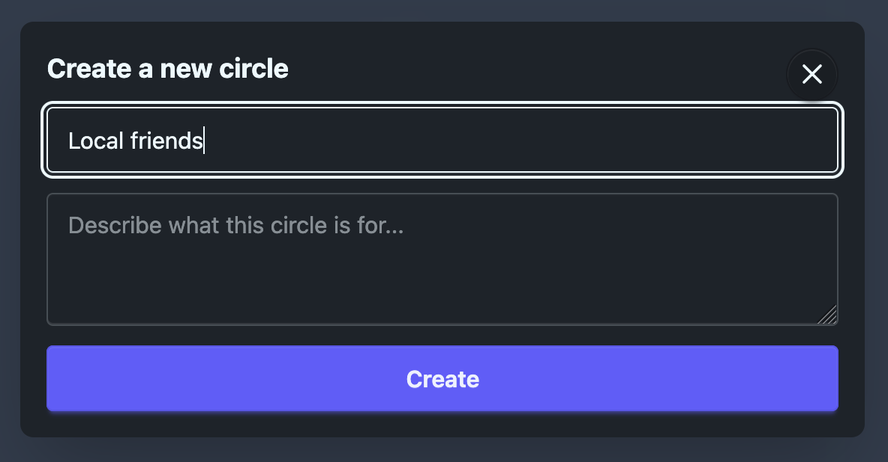
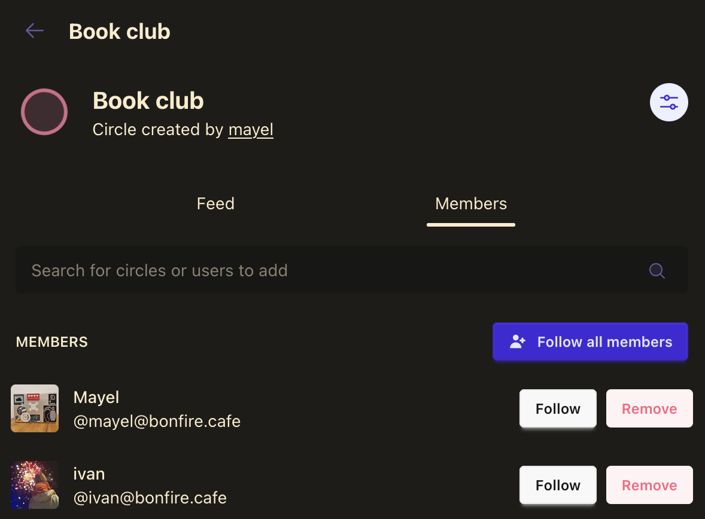
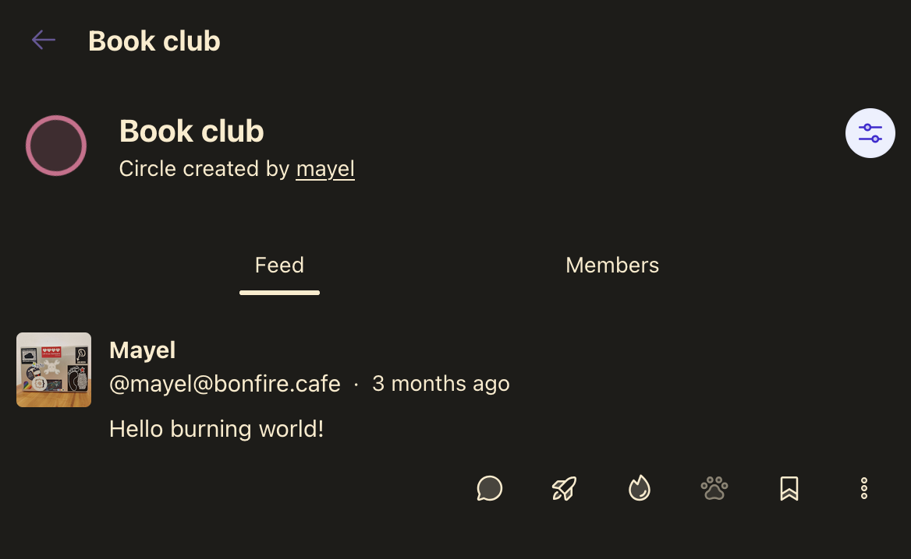
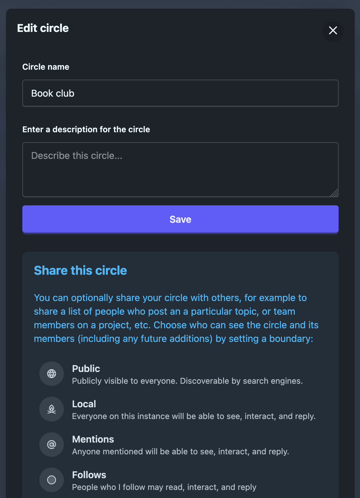
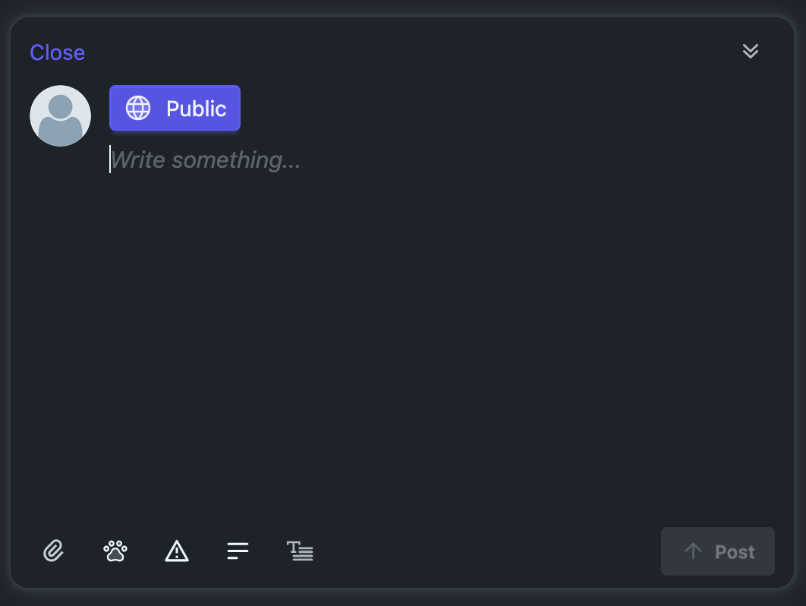
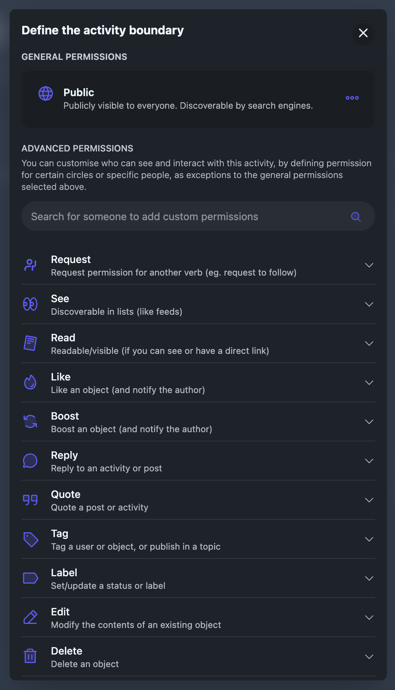
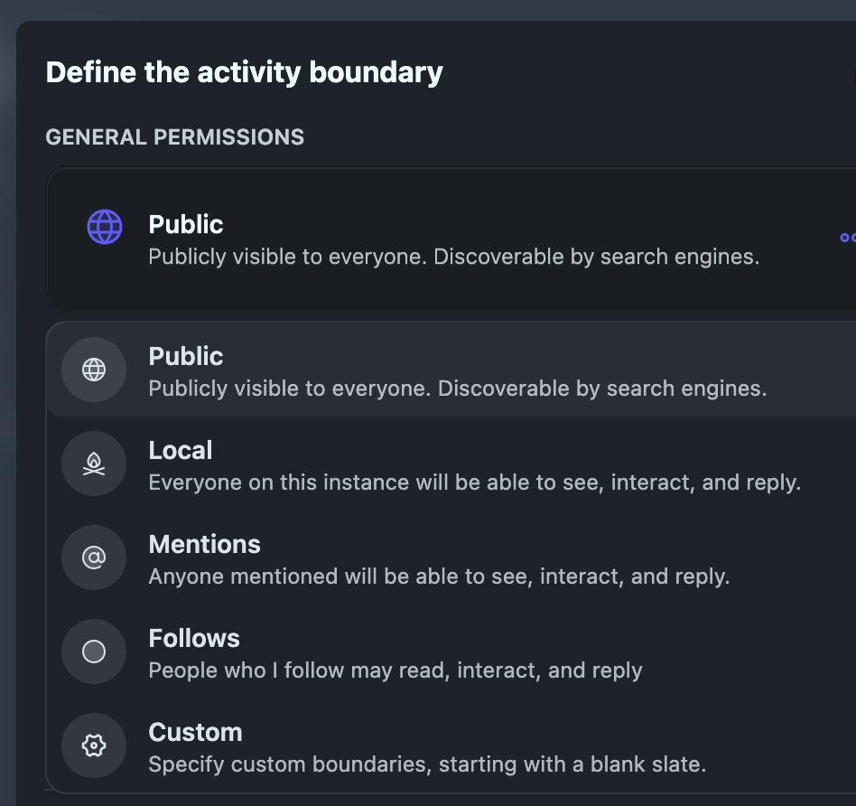
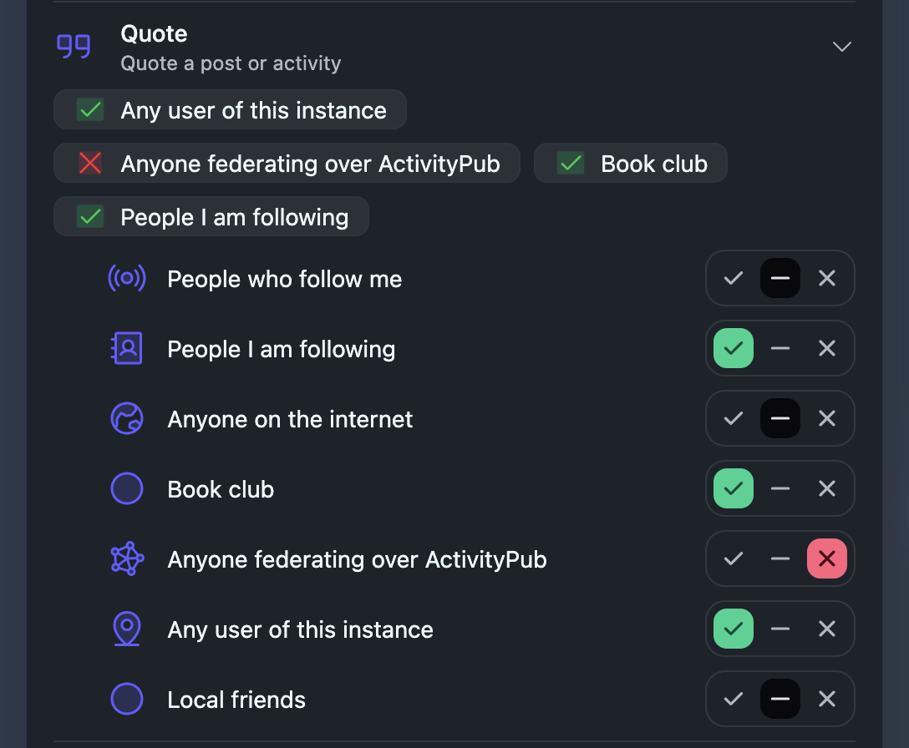
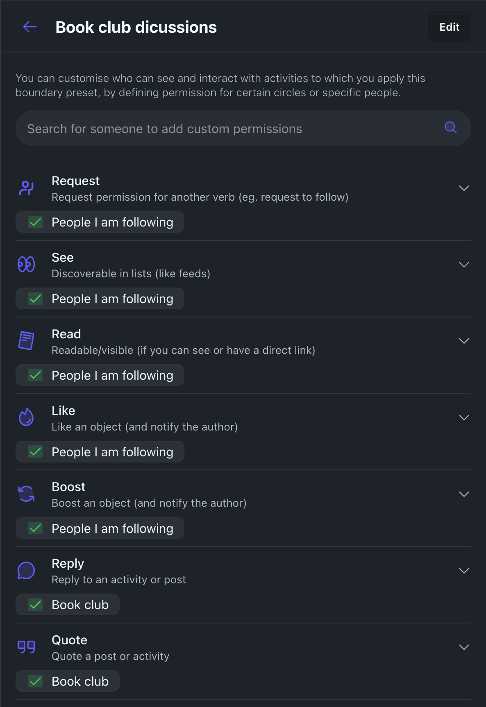

# Bonfire Boundaries: A User Guide

Bonfire’s circles and boundaries system is a powerful tool with which you can create custom groups of contacts and grant them specific permissions to interact with you and your content. They can help you take control of your online presence and ensure that your data is shared only with the people you want.

Boundaries define **who** can do **what** with your posts or activities, by enabling you to privately assign specific interaction permissions to any set of individual users and circles (groups of users), putting you in full control of your content and relationships.

Do you want to let certain circles see a post or activity, while other circles can both see and reply? You can do that with Boundaries. Want to make a post publicly viewable by everyone except a few specific people who won’t be interested? You can do that, too.

Boundaries help you maintain the integrity of your content and connections, and they’re interwoven with many other Bonfire features—and our underlying design principles—so using Bonfire will be easier and more intuitive once you start working with Boundaries.   

## Circles

A **circle** is simply a list of people. Bonfire comes with some default circles, like “guests” and “people I follow,” and you can also make your own, like “friends”, “classmates”, “monster movie fans” or “people who don’t like monster movies.”

**Circles** are a tool that can be used to establish relationships. They are representations of multifaceted relationships that you have with people in your life. Circles can help you understand the different levels of intimacy and trust you have with various people, as well as the different contexts or topics relevant to particular relationships. They can also help build stronger, healthier connections.

In Bonfire, you can define circles based on your unique style of relationships and interests. For example, you might create a circle for your *colleagues*, which can help you keep track of work-related content and collaborate with them more efficiently. You could also have a *locals* circle, with which you may share and discover local events, news, and recommendations. You might also create a *comrades* circle, to stay connected with fellow activists and organise around shared goals. Finally, you could create a *happy hour* circle, to coordinate social gatherings with local friends or colleagues, and *the crew* for your inner circle. 

With circles, you have the flexibility to manage your relationships and social activities in a way that makes sense for you.

You can find your circles in settings and create new ones:

### Adding Members to a Circle

You can add members to a circle when creating it or by editing an existing circle. To add members:

1. Go to the circle's page or the circles settings.
2. Click the members button.
3. Use the search interface to add people to the circle. Alternatively, you can click the circle button when viewing someone's profile and select what circles you want them in from there.

### Viewing a Feed of Activities from Circle Members

Each circle has its own feed, showing posts and activities from all its members. To view it:

1. Navigate to the circle's page.
2. Click the "Feed" tab to see all activities from members of that circle.

### Sharing a Circle

Circles are private by default, but you can share a circle with others if you wish:

1. On the circle page, click the settings button.
2. Select a boundary to control who can see the shared circle (e.g., only specific people or circles).
3. Send them a link to your circle.

When someone receives a shared circle link (and has permission via the boundary you selected), they can:

- View the circle's feed and see activities from all its members.
- See a list of members and optionally click a "Follow all members" button to quickly follow everyone in the circle.

This makes it easy to coordinate, discover, and connect with groups of people in Bonfire.

## Boundaries

**Boundaries** are limits that you set for yourself or others to define what you're comfortable with.

These limits can be physical, like curtains or doors; digital, like privacy settings on a social network; written, like codes of conduct; emotional, such as taking time for self-care; or mental, like choosing what you pay attention to. In Bonfire, boundaries help limit the types of interactions others may have with you or your posts.

Boundaries are important because they help you protect yourself, maintain your autonomy, and communicate your needs and expectations clearly.

A boundary in Bonfire defines who (which **users or circles**) can do what (have which **permissions**) with regard to a post or activity.

Boundaries can include multiple circles or individuals, and you can directly toggle what each of them can or cannot do for each action (verb) — such as read, reply, like, or boost — right from the post composer. This gives you precise, intuitive control over access and interaction for every post. 

For example, you might allow your "friends" circle to reply and like, but restrict "acquaintances" to only read, and block a specific user from interacting at all. 

You can define boundaries on-the-fly when posting (see ), or create one in your boundary settings, giving it a name and description, to be able to reuse it anytime you make a post and want to apply the same boundaries.

### How to use boundaries

There are some very simple ways to use Boundaries, like selecting an option from the screen that appears when you publish a post/activity. For more advanced uses, we’ve built powerful controls and settings, and this guide will walk you through the key elements so you can effectively master this essential part of the Bonfire framework.

#### Quick Start: Setting a Boundary

It's as easy as 1-2-3 :-)

1. Write your post.

   

2. Click the boundary dropdown (which displays the currently selected or default boundary, for example “Public”).

   

3. Select a preset boundary from a list. You may pick from some default options, such as:
* **Public**: Publicly visible to everyone.  
* **Local**: Everyone on this instance will be able to see, like, boost, and reply.  
* **Follows**: People who **I follow** may read, like, boost and reply.  
* **Mentions**: Anyone mentioned will be able to see, interact, and reply.

   

4. You can also toggle which circles or users can or cannot perform each action (such as read, reply, like, boost) using the switches or icons next to each.

    

5. Done! You’ve set a boundary and can now publish your post.

#### Detailed guide to using boundaries

To avoid having to toggle a bunch of circles/people every time you post, you can use Boundary presets. Define them in your Boundary settings and they will appear in the drop-down list once set up.

To do so, visit the Boundary presets page in your settings. There, you can create a new preset by adding a name and an optional description, then selecting one or more circles or users and assigning permissions for each action.

Once created, the Boundary will automatically be added to the composer Boundary list. You can control which Boundaries are shown in the composer list, as well as set your default active Boundary in the Boundary extension settings.

##### Overriding boundary presets

Even when using boundary presets, you can still adjust access or interaction permissions for a specific post, using the toggles in the boundary modal to grant or revoke permissions for each circle or user and each action. For example, you could allow "friends" to reply and like, but deny those actions for "acquaintances" or specific users.

This direct toggling allows you to easily personalize permissions for each post without needing to create a new Boundary preset every time. If you find yourself making the same tweaks repeatedly, you can create a new preset in your Boundary settings for quick reuse.

##### How Bonfire handles conflicting or complex sets of permissions

Since any Boundary can include multiple circles or users—each with its own permissions—and users may belong to several circles, the system must resolve situations where a user receives conflicting permissions.

For example, imagine you want to share a post publicly, but you want one specific circle to be unable to interact with the post (e.g., like or reply), while also allowing close collaborators to read, interact, and even edit it.

Bonfire handles these scenarios by merging all permissions from the different toggles assigned to each circle or user in the Boundary, always applying the most restrictive permission for each user.

In this example, if a close collaborator (who should normally be able to interact and edit) also belongs to the circle that cannot interact, Bonfire will resolve their final permission to “cannot interact.”

To summarize:

* No overrides both Neutral and Yes.  
* Yes is only granted if no other toggle explicitly denies it.

Or, more succinctly: No \> Yes \> Neutral

This cautious approach ensures that actions are never accidentally permitted. If a permission has been explicitly denied, it cannot be overridden by another toggle assigning it as **Yes**. Users must intentionally and explicitly set permissions to grant access or allow interaction, giving you consistent control over what others can do.

Understanding the final set of permissions applied to a user who belongs to multiple circles can be challenging. That’s why Bonfire provides a feature that allows you to look up a single user and preview the computed permissions associated with them.

#### How Boundaries federate

Think of a boundary like a curtain:  
• You can close it to block out what you don’t want to see.  
• You can open it to share something with specific people.  
• But you can’t control what others do behind their own curtains — or what happens in the street outside.

Bonfire enforces your boundaries—who can see, reply, or quote your posts—on your instance and for everyone using it. When your posts are shared to other servers, Bonfire includes your boundaries and preferences in the outgoing message. Most platforms respect basic boundaries (like who can see your post), but only some support advanced controls. If a remote platform doesn't support these, Bonfire will still block unauthorized interactions from reaching you and your instance.

For example, if you create a post with a custom boundary (e.g. only allowing your follows to see, and friends and colleagues circles to reply and quote), Bonfire encodes that into a standard ActivityPub message. Only the intended recipients receive it — much like BCC in email. If someone isn’t in the allowed audience, they won’t see the post at all — unless it’s also marked as “public.”

If someone tries to quote your post from another platform that supports "interaction policies", it will check your boundaries, and if your approval is required, you'll get a request you can accept or reject. If you deny the request, the quote won't be created or federated; if you accept, the quote will go through and be visible to others.

Boundaries and interaction policies give you more control and safety, but absolute control isn't possible in a federated world.

#### ✅ What boundaries can do

- Give you fine-grained control over who can see, reply to, or interact with content within your Bonfire instance and for everyone using it.
- Deliver posts to specific people or groups, including on remote servers, without revealing the full recipient list (using BCC addressing, like email).
- Express and enforce interaction policies (such as who can reply, like, boost, or quote) using the "interaction policies", following [FEP-044f](https://codeberg.org/fediverse/fep/src/branch/main/fep/044f/fep-044f.md).
- Hide or prevent actions like quoting or replying on platforms that support interaction policies, and block unauthorized interactions from reaching your instance even if the remote platform doesn't support or enforce them.
- Require your approval before someone can quote or interact with your post, and allow you to preview and approve or reject such requests.
- Filter or ignore unwanted interactions based on your chosen roles (e.g., you won’t see replies from someone you've blocked from replying, and they won't be shown under your original post on your instance).

#### ⚠️ What boundaries can’t do

- Prevent someone outside your instance from *attempting* to interact in a way you disallowed (e.g. replying to a “read-only” post) — their software or remote platform may still let them do it (and share it with their followers), as it may not support or enforce interaction policies. Bonfire will still block unauthorized actions from reaching you and your instance. 
- Hide *public* posts from specific people — “cannot read” doesn’t always work on content already made public (since they could anyway read it using an incognito browsing session). 
- Stop someone from copying, screenshotting, or reposting something you shared with them.
- Prevent server administrators of remote instances from accessing your content, since there is no end-to-end encryption (content is encrypted in transit but stored in plaintext on the server). In fact, if any of your recipient flags your content for harrassment, it will be shown to moderators. If you need strong guarantees of privacy, consider using end-to-end encrypted tools like Signal. 

---

## Appendix: Roles (for moderation and admin) 

In Bonfire, roles allow you to assign a defined *set of permissions* to users or circles, enabling them to perform specific actions. They are primarily used for moderation and instance administration.

By assigning roles, you can establish specific permissions and restrictions, ensuring that users or circles have appropriate access and abilities based on their relationship with you, the purpose of the boundary, or the nature of the content to which they're applied. 

There are some predefined roles, but you can also make your own with different sets of permissions. Here are some roles and their associated actions:

* Read: can discover the content in lists (like feeds) and read it; request permission for another verb (e.g., request to follow). 

* Interact: can read, plus like an object (and notify the author); follow a user or thread; boost an object (and notify the author); pin something to highlight it.

* Participate: can interact, plus reply to an activity or post; mention a user or object (and notify them); send a message.

* Contribute: can participate, plus create a post or other object; tag a user or object or publish in a topic.

* Moderator: can perform all of the above actions and more, including actions like reviewing flags (and flagged content) and acting on them.

* Caretaker: can perform all of the above actions and more, including actions like deletion.

There are also negative roles, indicating actions which you specifically do not want to allow a particular circle or user to do, such as:

* Cannot Read: not discoverable in lists or readable, and also can't interact or participate.

* Cannot Interact: cannot perform any actions related to interaction, including liking, following, boosting, and pinning, and also can't participate.

* Cannot Participate: cannot perform any actions related to participation, including replying, mentioning, and sending messages.

Negative roles simply limit or override any permissions defined elsewhere, ensuring that the specified actions are explicitly restricted.
